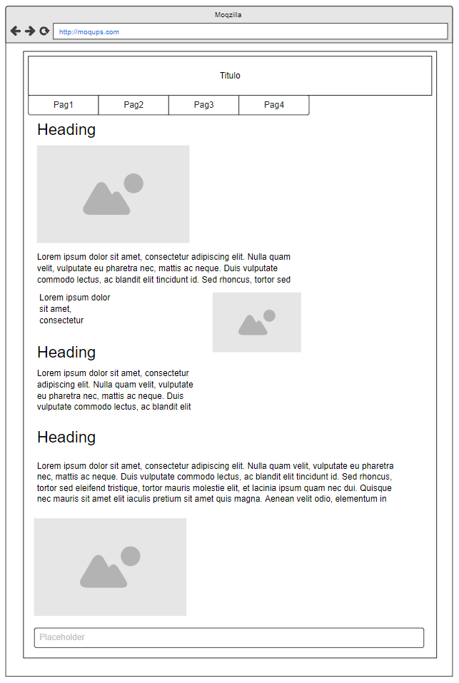
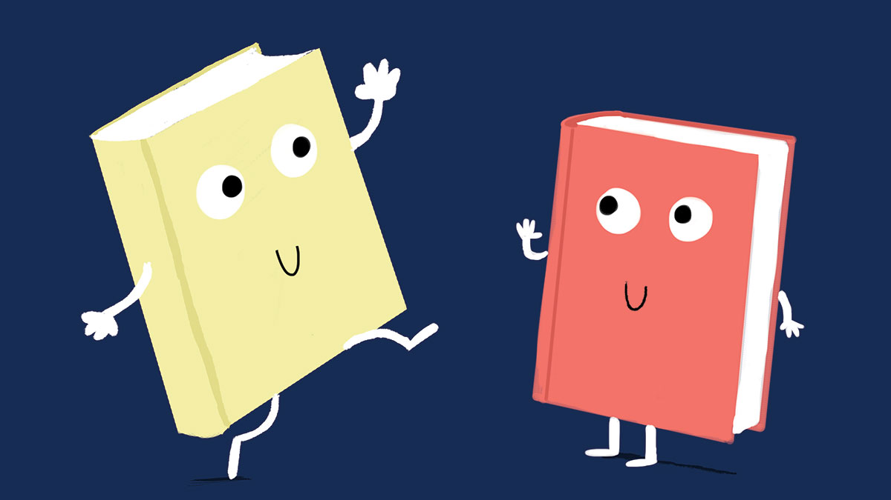

# SALVEMOS A LOS LIBROS

## •De qué trata este proyecto

En la clase de IAW se nos ha planteado el siguiente proyecto:

> En Instituto Cuatrovientos se ha creado un nuevo aula de descanso para el alumnado. !Es genial! Un espacio abierto para el uso del alumnado en su tiempo libre, 
ya sea para estudiar, tomar un café o charlas relajadamente, eso si, sin hacer mucho ruido. 

> • Pero desde parte de los alumnos del centro se le ha detectado una pega, _¿Qué va a pasar con todos eso libros en papel que se encontraban en la antigua Biblioteca?_ 

## •Solución
Mi solución ha sido crear una página web en la cual se explica cómo los libros serás guardados, digitalizados y finalmente reciclados para imprimir nuevos libros o material escolar.  

Dado que el proceso constará de varias etapas, empezando por recoger los libros de la sala, digitalizarlos e ir transportándolos a la empresa que se dedicará a reciclarlos y convertirlos en nuevo material.

# Estilos
- He utilizado esta paleta de colores, completamente personalizada. Resaltar que el fondo he hecho un gradiente del azul primario a negro.
![¡SALVEMOS LOS LIBROS!][¡SALVEMOS LOS LIBROS!](./images/colors.png)
- He utilizado dos tipos de fuentes, open sans y sans serif.
- Mockups de mi web:
## INDEX

  
[Nuestra Web](index.html)
